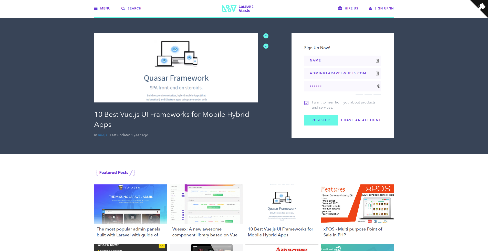
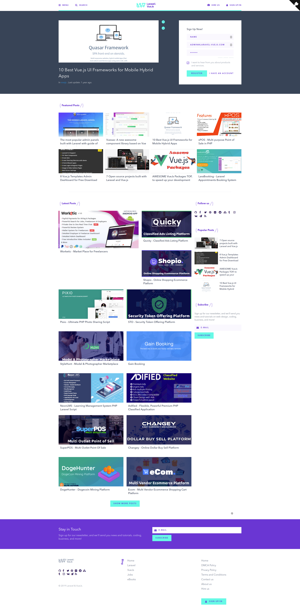
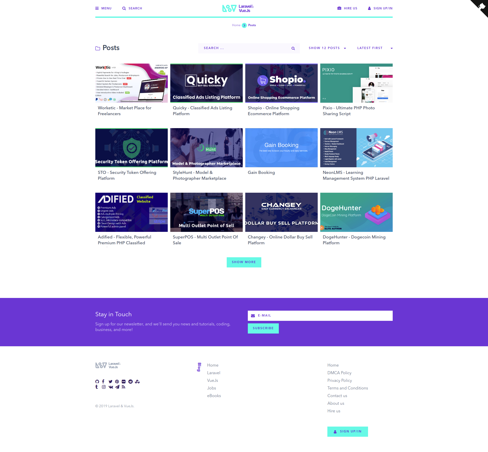

# Introduction
Laravel-VueJs.com Open source CMS based on Latest technologies of Laravel and VueJs, using Laravel nova, 
GraphQL, NuxtJs, Apollo and ...more

\#Laravel #VueJS #GraphQL #Apollo #NuxtJs #Nova

## [DOCS (WIP)](http://laravel-vuejs.com/docs)

## [Laravel-VueJs.com](http://laravel-vuejs.com/docs)
 

### Server Requirements
The Laravel framework has a few system requirements. 

- PHP >= 7.1.3
- npm >= 6.4.1
- nodejs >= 10.15.3
- OpenSSL PHP Extension
- PDO PHP Extension
- Mbstring PHP Extension
- Tokenizer PHP Extension
- XML PHP Extension
- Ctype PHP Extension
- JSON PHP Extension
- BCMath PHP Extension

> More Information [here](https://laravel.com/docs/master#installation)

### Backend packages
- Laravel
- Laravel Nova
- Lighthouse (Graphql Library)
- Algolia
- Laravel Cors
- Laravel Enum
- Larecipe
- Passport
- Scout
- Socialite
- Telescope
... and more 

### Frontend packages
- VueJs
- Nuxt 
- Apollo
- Graphql
- Font Awesome
- Moment
- Toast
- Bootstrap
- Disqus
- Awesome swiper
... and more 

### Preview
> ##### Home Page

> ##### Posts list

## Contributors
- [Anass Ez-zouaine](https://github.com/ansezz)
- [Othmane Gourirran](https://github.com/OthmanDev)
- [Omar Bourhaouta](https://github.com/bourhaouta)

## Contributing
Do not hesitate to contribute to the project by adapting or adding features ! Bug reports or pull requests are welcome.

## License
The project is open-sourced software licensed under the [MIT license](http://opensource.org/licenses/MIT).
